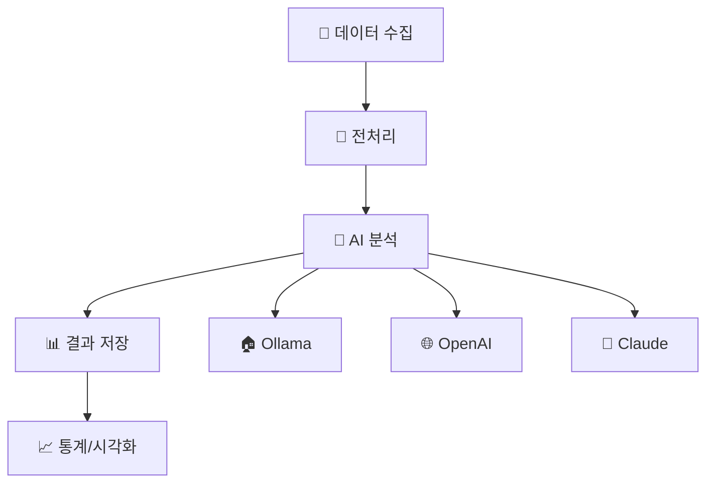

# 🏗️ Section 1: TRAS 프로젝트 소개
## "실무에서 배우는 AI 아키텍처"

### 10분 완주하기

---

## 🎯 Section 1 학습 목표

이 섹션을 마치면 여러분은:

1. **🏗️ 아키텍처 설계**: 확장 가능한 AI 시스템 구조 이해
2. **🔧 실무 패턴**: 프로덕션 레벨 코드의 모범 사례
3. **🤖 AI 통합**: 여러 AI 제공자를 하나의 시스템에서 관리
4. **📊 도메인 이해**: 정부 인재 추천이라는 실제 문제

---

## 🌟 TRAS란 무엇인가?

### **T**alent **R**ecommendation **A**nalysis **S**ystem

```python
# 한 줄로 설명하는 TRAS
def tras_essence():
    return "AI가 이메일과 소셜미디어에서 정부 인재를 찾아주는 시스템"

# 비유: 디지털 헤드헌터
# 🔍 사람이 하던 인재 발굴을 AI가 24/7 수행
# 📧 이메일 속 추천서 자동 분석
# 🐦 트위터 댓글에서 숨은 인재 발굴
```

### 🎪 왜 이 프로젝트인가?
- **실무성**: 실제 정부에서 사용할 수 있는 수준
- **완전성**: 데이터 수집부터 결과 출력까지 전체 파이프라인
- **확장성**: 새로운 AI 모델을 쉽게 추가할 수 있는 구조

---

## 🏗️ 시스템 아키텍처: "레고 블록 조립하기"

### 🧩 핵심 구성요소



### 💭 비유: 음식점 주방
- **📧 재료 준비**: 이메일/소셜미디어 데이터 수집
- **🔧 손질**: 텍스트 정제 및 토큰화
- **🤖 요리**: AI 모델들이 각자의 방식으로 분석
- **📊 플레이팅**: 결과를 보기 좋게 정리

---

## 📁 프로젝트 구조 탐험

### 🗂️ 디렉토리 구조

```bash
TRAS/
├── 📄 main.py              # 통합 시스템 메인
├── 📄 email_analyzer.py    # 이메일 전용 분석기
├── 📁 scripts/             # 개발/릴리스 도구
├── 📁 emails/              # 이메일 데이터
├── 📄 pyproject.toml       # 프로젝트 설정 (UV 기반)
├── 📄 requirements.txt     # 호환성용 의존성
└── 📄 README.md           # 프로젝트 가이드
```

### 🔍 핵심 파일들 미리보기

```python
# main.py - 진입점
def main():
    """통합 분석 시스템의 시작점"""
    # 1. AI 제공자 초기화
    # 2. 데이터 로드
    # 3. 분석 실행
    # 4. 결과 저장
```

---

## 🤖 AI 제공자 패턴: "다양한 요리사, 하나의 주방"

### 🎭 추상화 설계

```python
from abc import ABC, abstractmethod

class AIProvider(ABC):
    """AI 제공자 기본 인터페이스"""
    
    @abstractmethod
    def analyze_text(self, text: str) -> dict:
        """텍스트를 분석하여 구조화된 결과 반환"""
        pass
    
    @abstractmethod
    def is_available(self) -> bool:
        """AI 서비스 사용 가능 여부 확인"""
        pass
```

### 🔄 구체적 구현

```python
class OllamaProvider(AIProvider):
    """로컬 AI - 개인정보 보호 최우선"""
    
class OpenAIProvider(AIProvider):
    """클라우드 AI - 높은 성능"""
    
class ClaudeProvider(AIProvider):
    """Anthropic AI - 안전하고 정확한 분석"""
```

---

## 💡 비유로 이해하는 AI 제공자들

### 🏠 Ollama: "집에서 요리하는 요리사"
- **장점**: 프라이버시 완벽, 무제한 사용, 비용 없음
- **단점**: 준비 시간 필요, 하드웨어 성능 의존
- **언제 사용**: 민감한 데이터, 대량 처리

### 🌐 OpenAI: "미슐랭 레스토랑 셰프"
- **장점**: 최고 품질, 빠른 속도, 안정성
- **단점**: 비용 발생, 인터넷 필요
- **언제 사용**: 고품질 분석, 소량 정밀 작업

### 🧠 Claude: "신중한 전문가"
- **장점**: 한국어 특화, 윤리적 판단, 긴 문맥 이해
- **단점**: 상대적 고비용, 사용량 제한
- **언제 사용**: 복잡한 문서, 정확성 중요 업무

---

## 🛠️ 실무 코드 패턴: "확장 가능한 설계"

### 🔧 Factory Pattern 구현

```python
class AIProviderFactory:
    """AI 제공자 팩토리 - 런타임에 선택"""
    
    @staticmethod
    def create_provider(provider_type: str, config: dict) -> AIProvider:
        providers = {
            'ollama': OllamaProvider,
            'openai': OpenAIProvider,
            'claude': ClaudeProvider
        }
        
        if provider_type not in providers:
            raise ValueError(f"Unknown provider: {provider_type}")
            
        return providers[provider_type](config)

# 사용 예시
provider = AIProviderFactory.create_provider('ollama', config)
result = provider.analyze_text("정부 AI 정책관에 김철수를 추천합니다.")
```

### 🎯 핵심 포인트
- **확장성**: 새 AI 추가 시 기존 코드 변경 없음
- **유지보수**: 각 제공자별 독립적 관리
- **테스트**: Mock 객체로 쉬운 단위 테스트

---

## 📊 데이터 구조: "정보의 DNA"

### 🧬 분석 결과 스키마

```python
@dataclass
class AnalysisResult:
    """AI 분석 결과의 표준 형식"""
    
    is_recommendation: bool              # 추천 여부
    government_positions: List[str]      # 추출된 정부 직책
    ai_summary: str                      # AI 생성 요약
    ai_keywords: List[str]              # 핵심 키워드
    recommendation_type: str             # "본인지원"|"타인추천"|"의견제시"
    confidence_score: int                # 신뢰도 (1-10)
    ai_provider: str                     # 사용된 AI 제공자
    
    # 소셜미디어 전용 필드
    likes_count: Optional[int] = None
    retweets_count: Optional[int] = None
    replies_count: Optional[int] = None
```

### 💭 설계 철학: "하나의 언어로 소통"
- 어떤 AI 제공자든 같은 형식으로 결과 반환
- 데이터베이스 저장과 분석에 일관성 제공
- 새로운 필드 추가 시 하위 호환성 유지

---

## 🗄️ 데이터 저장: "기억의 창고"

### 🏛️ SQLite 데이터베이스 구조

```sql
CREATE TABLE content_analysis (
    id INTEGER PRIMARY KEY,
    content_type TEXT,           -- 'email' 또는 'twitter'
    source_file TEXT,            -- 소스 파일명
    username TEXT,               -- 사용자명/발신자명
    is_recommendation INTEGER,   -- 추천 여부 (0/1)
    government_positions TEXT,   -- JSON 배열로 저장
    ai_summary TEXT,            -- AI 생성 요약
    ai_keywords TEXT,           -- JSON 배열로 저장
    recommendation_type TEXT,    -- 추천 유형
    confidence_score INTEGER,    -- 신뢰도 점수
    ai_provider TEXT,           -- 사용된 AI
    created_at TIMESTAMP DEFAULT CURRENT_TIMESTAMP
);
```

### 🔍 비유: 도서관 시스템
- **인덱싱**: 빠른 검색을 위한 키 설정
- **분류**: content_type으로 이메일/트위터 구분
- **메타데이터**: 언제, 누가, 어떤 AI로 분석했는지 기록

---

## ⚙️ 설정 관리: "시스템의 DNA"

### 🧬 pyproject.toml - 현대적 프로젝트 설정

```toml
[project]
name = "integrated-social-media-talent-recommendation-analysis-system"
version = "3.0.1"
description = "AI-powered integrated system for analyzing government talent recommendations"
requires-python = ">=3.8.1"

[project.optional-dependencies]
ai = [
    "anthropic>=0.18.0",
    "openai>=1.0.0",
]

[project.scripts]
talent-analyzer = "main:main"
tras-release = "scripts.release:main"
```

### 🎯 UV 활용의 장점
- **빠른 설치**: pip보다 10-100배 빠른 의존성 해결
- **재현 가능**: uv.lock으로 정확한 버전 고정
- **선택적 설치**: AI 제공자별 옵션 패키지

---

## 🚀 실습: TRAS 시스템 체험하기

### 📋 1단계: 환경 설정

```bash
# 프로젝트 클론
git clone https://github.com/Baryon-ai/TRAS.git
cd TRAS

# UV로 의존성 설치
uv sync

# AI 제공자 포함 설치
uv sync --extra ai
```

### 📋 2단계: 기본 실행

```bash
# 이메일 분석기 실행
uv run email_analyzer.py

# 통합 시스템 실행
uv run main.py
```

### 📋 3단계: 결과 확인
- 데이터베이스에 저장된 분석 결과 확인
- CSV 파일로 내보내기
- 통계 대시보드 확인

---

## 🔍 메타인지 체크포인트 #1

### 🤔 스스로 점검해보세요

1. **아키텍처 이해도**
   - "TRAS의 핵심 구성요소 3가지를 설명할 수 있나?"
   - "왜 여러 AI 제공자를 지원하도록 설계했을까?"

2. **패턴 인식**
   - "Factory Pattern의 장점을 실무 관점에서 설명할 수 있나?"
   - "데이터베이스 스키마에서 확장성을 어떻게 고려했을까?"

3. **실무 연결**
   - "이 설계 패턴을 내 프로젝트에 어떻게 적용할 수 있을까?"
   - "비슷한 도메인 문제를 해결한다면 어떻게 접근할까?"

---

## 🎨 코드 품질과 개발 도구

### 🛠️ 현대적 개발 환경

```bash
# 코드 포맷팅
uv run black .

# 타입 체킹
uv run mypy main.py

# 린팅
uv run flake8

# 테스트
uv run pytest --cov

# 릴리스 관리
uv run tras-release patch
```

### 🏆 모범 사례들
- **타입 힌트**: 코드 의도 명확화
- **도큐멘테이션**: README와 인라인 주석
- **테스트**: 단위 테스트와 통합 테스트
- **CI/CD**: GitHub Actions 자동화

---

## 💡 설계 철학: "미래를 위한 코드"

### 🌱 확장 가능한 설계 원칙

1. **개방-폐쇄 원칙**: 새 기능 추가 시 기존 코드 수정 최소화
2. **의존성 역전**: 추상화에 의존, 구체적 구현에 의존하지 않음
3. **단일 책임**: 각 클래스/함수는 하나의 명확한 역할

### 🔮 미래 확장 계획
- **새로운 AI 모델**: GPT-5, Claude-4 등 쉽게 추가
- **다양한 데이터 소스**: 페이스북, 링크드인, 유튜브
- **실시간 처리**: 스트리밍 데이터 분석
- **웹 인터페이스**: Flask/FastAPI 기반 대시보드

---

## 🎯 Section 1 요약

### ✅ 우리가 배운 것들

1. **🏗️ 실무 아키텍처**: 확장 가능하고 유지보수 가능한 시스템 설계
2. **🤖 AI 통합 패턴**: 여러 AI 제공자를 하나의 인터페이스로 관리
3. **📊 데이터 모델링**: 일관된 분석 결과 구조화
4. **🛠️ 현대적 도구**: UV, 타입 힌트, 자동화된 릴리스

### 🔗 다음 섹션 예고
이제 **자연어처리의 기초**로 들어가겠습니다.
TRAS가 텍스트를 어떻게 이해하고 분석하는지
그 내부 동작을 파헤쳐보겠습니다!

---

## 💭 마무리 생각거리

### 🤓 심화 사고 질문

1. **확장성**: "만약 TRAS를 100만 명이 동시에 사용한다면?"
2. **보안성**: "민감한 정부 데이터를 어떻게 안전하게 처리할까?"
3. **국제화**: "한국어가 아닌 다른 언어도 지원하려면?"
4. **실시간성**: "실시간으로 소셜미디어를 모니터링하려면?"

### 💡 프로젝트 아이디어
- TRAS를 기반으로 한 채용 추천 시스템
- 학술 논문에서 연구자 추천 시스템
- 오픈소스 프로젝트에서 기여자 발굴 시스템

---

## 🚀 Ready for Deep Dive?

다음 50분 동안 우리는 **자연어처리의 깊은 바다**로 
잠수할 것입니다.

🌊 **Section 2: 자연어처리 기초**에서 만나요! 