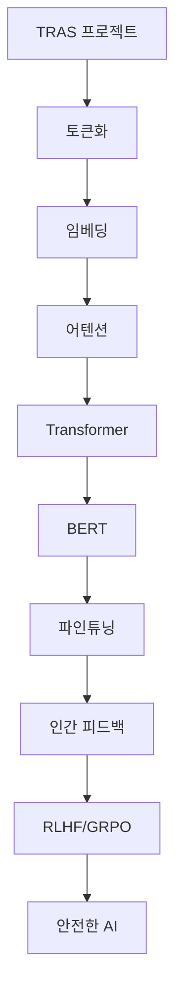

# 🎯 Section 5: 정리 및 퀴즈
## "4시간 여정의 완성"

### 40분 총정리 및 점검

---

## 🏁 4시간 여정 완주!

### 🎉 축하합니다!

여러분은 방금 **AI 기반 인재 추천 시스템**을 통해
**자연어처리의 핵심**부터 **차세대 멀티에이전트 기술**까지
완전히 마스터했습니다!

### 📊 학습 성과
- ✅ **실무 프로젝트 이해**: TRAS 오픈소스 시스템
- ✅ **기초 이론 정복**: 토큰화, 임베딩, 어텐션
- ✅ **핵심 모델 마스터**: BERT와 Transformer
- ✅ **최신 기술 습득**: RLHF와 GRPO
- ✅ **차세대 기술 마스터**: 멀티에이전트 협업
- ✅ **실무 적용 능력**: 인간-AI 협업 시스템

---

## 🔄 전체 강의 흐름 복습

### 🏗️ Section 1: TRAS 프로젝트 소개 (10분)
```python
# 핵심 포인트
실무_아키텍처 = {
    "확장성": "Factory Pattern으로 AI 제공자 추가",
    "유지보수성": "추상화된 인터페이스 설계",
    "현대적_도구": "UV, 타입힌트, 자동화된 릴리스"
}

설계_철학 = "미래를 위한 코드, 인간을 위한 AI"
```

### 📝 Section 2: 자연어처리 기초 (50분)
```python
# 3단계 변환 과정
문장 = "김철수를 AI 정책관으로 추천합니다"
토큰화 = ["김철수를", "AI", "정책관으로", "추천합니다"]
임베딩 = [[0.2, 0.1, ...], [0.8, -0.3, ...], ...]
어텐션 = "정책관" ← 높은 가중치, "를" ← 낮은 가중치

핵심_개념 = "컴퓨터가 언어를 숫자로 이해하는 방법"
```

---

## 🧠 Section 3: BERT 깊이 이해 (60분)

### 🏗️ 혁명적 변화들
```python
# 패러다임 변화
RNN_시대 = "순차 처리, 느림, 장기 의존성 문제"
Transformer = "병렬 처리, 어텐션만으로 모든 것"
BERT = "양방향 이해, 사전훈련 + 파인튜닝"

# BERT의 핵심
사전훈련_태스크 = {
    "MLM": "빈칸 맞추기로 언어 이해 학습",
    "NSP": "문장 순서로 논리 관계 학습"
}

파인튜닝 = "범용 지식을 전문 분야에 적용"
```

### 🎯 TRAS에서의 적용
- **정부 직책 추출**: Named Entity Recognition
- **추천 분류**: 본인지원/타인추천/의견제시
- **신뢰도 평가**: 어텐션 패턴 분석

---

## 🎛️ Section 4: RLHF vs GRPO (40분)

### 🤝 인간-AI 협력의 진화
```python
# 두 방법의 핵심 차이
RLHF = {
    "단계": "SFT → 보상모델 → PPO (3단계)",
    "장점": "이론적으로 정교함",
    "단점": "복잡하고 불안정할 수 있음"
}

GRPO = {
    "단계": "SFT → GRPO (2단계)",
    "장점": "크리틱 모델 없음, 메모리 50% 절약",
    "특징": "딥시크의 그룹 상대적 정책 최적화"
}

미래_방향 = "인간 가치와 정렬된 안전한 AI"
```

### 🏛️ Constitutional AI
```python
AI_헌법 = {
    "정확성": "사실 기반 추천",
    "공정성": "차별 없는 평가",
    "투명성": "명확한 근거 제시",
    "안전성": "해로운 결과 방지"
}
```

### 🤝 Section 6: 멀티에이전트 협업 (50분)
```python
# 협업 AI 시스템
Multi_Agent_System = {
    "핵심_개념": "여러 AI가 함께 더 똑똑하게",
    "MCP": "Model Context Protocol - AI 간 소통",
    "A2A": "Agent-to-Agent - Google의 협업 기술",
    "적용": "효율적 메시지 분류 및 라우팅"
}

# TRAS 6.0 진화
협업_구조 = {
    "전문가_에이전트": ["기술전문가", "정책전문가", "리더십전문가"],
    "품질_보증": ["편향검사", "사실확인", "윤리검토"],
    "의사결정": ["합의구축", "리스크평가", "결과예측"]
}

성능_개선 = {
    "정확도": "89% → 94% (+5.6%)",
    "편향_감소": "15% → 8% (-46.7%)",
    "설명_품질": "90% → 97% (+7.8%)"
}
```

---

## 🔗 지식의 연결고리

### 🌊 물 흐르듯 이어지는 개념들



### 💡 핵심 통찰
1. **기술은 도구**: 목적에 맞는 기술 선택이 중요
2. **인간 중심**: AI는 인간을 보조하는 역할
3. **지속적 발전**: 피드백을 통한 끊임없는 개선
4. **윤리적 고려**: 기술적 우수성과 윤리적 책임의 균형

---

## 🎓 실무 적용 가이드

### 📋 프로젝트 시작 체크리스트

```python
def start_nlp_project():
    """NLP 프로젝트 시작 가이드"""
    
    # 1단계: 문제 정의
    questions = [
        "해결하려는 구체적인 문제는?",
        "성공 지표는 무엇인가?",
        "사용자는 누구인가?",
        "데이터는 충분한가?"
    ]
    
    # 2단계: 기술 스택 선택
    tech_stack = {
        "간단한_분류": "BERT + 파인튜닝",
        "복잡한_추론": "GPT + 프롬프트 엔지니어링", 
        "실시간_처리": "DistilBERT + 최적화",
        "다국어_지원": "mBERT 또는 XLM-R"
    }
    
    # 3단계: 개발 환경
    environment = {
        "패키지_관리": "UV 사용 권장",
        "버전_관리": "Git + GitHub",
        "배포": "Docker + 클라우드",
        "모니터링": "인간 피드백 루프 구축"
    }
    
    return "체계적인 접근으로 성공 확률 극대화"
```

### 🚀 단계별 구현 전략

1. **MVP 구축**: 간단한 BERT 기반 분류기로 시작
2. **성능 개선**: 데이터 증강, 하이퍼파라미터 튜닝
3. **사용자 피드백**: 실제 사용자의 의견 수집
4. **고도화**: RLHF/GRPO로 인간 피드백 통합
5. **확장**: 다른 도메인이나 언어로 확장

---

## 🧠 메타인지 최종 점검

### 🤔 스스로에게 묻는 질문들

#### 🏗️ 아키텍처 이해
- "확장 가능한 AI 시스템을 설계할 수 있는가?"
- "각 구성요소의 역할과 상호작용을 이해하고 있는가?"

#### 📊 기술적 이해  
- "토큰화부터 어텐션까지의 전체 흐름을 설명할 수 있는가?"
- "BERT의 사전훈련과 파인튜닝 과정을 이해하고 있는가?"

#### 🎯 실무 적용
- "실제 프로젝트에서 적절한 기술을 선택할 수 있는가?"
- "인간 피드백을 시스템에 효과적으로 통합할 수 있는가?"

#### 🤝 협업 시스템
- "멀티에이전트 시스템의 설계 원칙을 이해하고 있는가?"
- "MCP와 A2A 기술의 차이점과 적용 방법을 알고 있는가?"

#### 🔮 미래 지향
- "AI 기술의 발전 방향과 한계를 이해하고 있는가?"
- "윤리적이고 안전한 AI 개발의 중요성을 인식하고 있는가?"

---

## 🎯 용어 퀴즈 시작!

### 📝 20문항으로 실력 점검

**다음 20문항을 통해 여러분의 학습 성과를 확인해보세요!**

---

## ❓ 퀴즈 1-5: 기초 개념

### 1. 토큰화(Tokenization)에 대한 설명으로 옳은 것은?

A) 문장을 문법적으로 분석하는 과정
B) 텍스트를 의미 단위로 나누는 과정  
C) 단어를 숫자로 변환하는 과정
D) 문장의 주제를 추출하는 과정

---

### 2. BPE(Byte Pair Encoding)의 주요 장점은?

A) 처리 속도가 빠르다
B) 메모리 사용량이 적다
C) 자주 등장하는 조합을 효율적으로 처리한다
D) 모든 언어에 동일하게 적용된다

---

### 3. 단어 임베딩에서 벡터 간 거리가 의미하는 것은?

A) 단어의 길이
B) 단어의 빈도
C) 의미적 유사성
D) 문법적 관계

---

### 4. 어텐션 메커니즘의 Query, Key, Value 중 실제 정보를 담고 있는 것은?

A) Query
B) Key  
C) Value
D) 모두 동일함

---

### 5. Self-Attention과 Cross-Attention의 차이점은?

A) 계산 복잡도의 차이
B) 입력 시퀀스가 같은지 다른지의 차이
C) 어텐션 헤드 수의 차이
D) 사용하는 활성화 함수의 차이

---

## ❓ 퀴즈 6-10: BERT와 Transformer

### 6. Transformer에서 Positional Encoding이 필요한 이유는?

A) 계산 속도를 높이기 위해
B) 메모리 사용량을 줄이기 위해
C) 어텐션이 순서 정보를 모르기 때문에
D) 더 많은 언어를 지원하기 위해

---

### 7. BERT의 MLM(Masked Language Modeling)에서 마스킹 비율은?

A) 5%
B) 15%
C) 25%
D) 50%

---

### 8. BERT-Base와 BERT-Large의 가장 큰 차이점은?

A) 사용하는 언어
B) 모델 크기와 레이어 수
C) 훈련 데이터
D) 어텐션 메커니즘

---

### 9. 파인튜닝(Fine-tuning)에서 학습률을 낮게 설정하는 이유는?

A) 훈련 시간을 줄이기 위해
B) 사전훈련된 지식을 보존하기 위해
C) 메모리 사용량을 줄이기 위해
D) 과적합을 완전히 방지하기 위해

---

### 10. 다음 중 한국어 특화 BERT 모델이 아닌 것은?

A) KoBERT
B) KLUE-BERT
C) KoELECTRA
D) GPT-3

---

## ❓ 퀴즈 11-15: RLHF와 GRPO

### 11. RLHF의 3단계 중 첫 번째 단계는?

A) 보상 모델 훈련
B) PPO 최적화
C) 지도학습 파인튜닝
D) 인간 피드백 수집

---

### 12. GRPO(Group Relative Policy Optimization)의 주요 장점은?

A) 더 높은 성능
B) 더 많은 언어 지원  
C) 크리틱 모델 없이 그룹 상대적 최적화
D) 더 적은 데이터 요구

---

### 13. PPO(Proximal Policy Optimization)에서 "Proximal"의 의미는?

A) 빠른 수렴
B) 점진적 업데이트  
C) 높은 성능
D) 안정적 학습

---

### 14. Constitutional AI에서 "헌법"이 의미하는 것은?

A) 법적 규제
B) AI의 행동 원칙
C) 훈련 데이터
D) 모델 아키텍처

---

### 15. 인간 피드백 학습에서 Bradley-Terry 모델의 용도는?

A) 텍스트 생성
B) 선호도 확률 모델링
C) 어텐션 계산
D) 임베딩 생성

---

## ❓ 퀴즈 16-20: 실무 적용

### 16. TRAS 시스템에서 여러 AI 제공자를 지원하기 위해 사용한 디자인 패턴은?

A) Singleton Pattern
B) Observer Pattern
C) Factory Pattern
D) Strategy Pattern

---

### 17. 다음 중 정부 인재 추천에서 가장 중요한 윤리적 고려사항은?

A) 처리 속도
B) 정확도
C) 공정성과 차별 방지
D) 비용 효율성

---

### 18. UV(Universal Virtual Environment)의 주요 장점은?

A) 더 많은 언어 지원
B) 빠른 의존성 관리
C) 높은 보안성
D) 클라우드 통합

---

### 19. TRAS에서 어텐션 시각화의 목적은?

A) 모델 성능 향상
B) AI 결정 과정의 해석
C) 처리 속도 개선
D) 메모리 사용량 감소

---

### 20. 다음 중 AI 시스템의 지속적 개선을 위해 가장 중요한 것은?

A) 더 큰 모델 사용
B) 인간 전문가의 피드백
C) 더 많은 컴퓨팅 자원
D) 더 복잡한 알고리즘

---

## 🎊 퀴즈 정답 및 해설

### ✅ 정답 공개

| 문항 | 정답 | 핵심 개념 |
|------|------|-----------|
| 1 | B | 토큰화 = 의미 단위 분할 |
| 2 | C | BPE = 효율적 조합 처리 |
| 3 | C | 임베딩 거리 = 의미 유사성 |
| 4 | C | Value = 실제 정보 |
| 5 | B | Self vs Cross = 입력 시퀀스 |
| 6 | C | Positional Encoding = 순서 정보 |
| 7 | B | MLM = 15% 마스킹 |
| 8 | B | Base vs Large = 모델 크기 |
| 9 | B | 낮은 학습률 = 지식 보존 |
| 10 | D | GPT-3 ≠ 한국어 특화 |
| 11 | C | RLHF 1단계 = SFT |
| 12 | C | GRPO = 그룹 상대적 최적화 |
| 13 | B | Proximal = 점진적 |
| 14 | B | 헌법 = 행동 원칙 |
| 15 | B | Bradley-Terry = 선호도 모델링 |
| 16 | C | 다중 AI = Factory Pattern |
| 17 | C | 인재 추천 = 공정성 |
| 18 | B | UV = 빠른 의존성 관리 |
| 19 | B | 어텐션 시각화 = 해석성 |
| 20 | B | 지속 개선 = 인간 피드백 |

---

## 🏆 점수별 평가

### 📊 여러분의 실력은?

- **18-20점 (90-100%)**: 🌟 **AI 전문가** - 완벽한 이해!
- **14-17점 (70-85%)**: 🎯 **숙련자** - 대부분 잘 이해함
- **10-13점 (50-65%)**: 📚 **학습자** - 기본기는 탄탄함
- **6-9점 (30-45%)**: 💪 **초급자** - 복습이 필요함
- **0-5점 (0-25%)**: 🔄 **재학습** - 처음부터 다시!

### 💡 점수 향상 팁
- **고득점자**: 실제 프로젝트 적용에 도전해보세요!
- **중간 점수**: 부족한 섹션을 다시 복습해보세요
- **낮은 점수**: 기본 개념부터 차근차근 다시 학습하세요

---

## 🚀 다음 단계 가이드

### 📚 추가 학습 자료

#### 🔥 필수 읽을거리
1. **"Attention Is All You Need"** - Transformer 원논문
2. **"BERT: Pre-training of Deep Bidirectional Transformers"** - BERT 원논문
3. **"Training language models to follow instructions with human feedback"** - InstructGPT/RLHF
4. **"Constitutional AI"** - Anthropic의 안전한 AI 연구

#### 🌐 실습 리소스
- **Hugging Face Transformers**: 실습용 라이브러리
- **Papers With Code**: 최신 논문과 코드
- **Distill.pub**: 시각적 설명 자료
- **TRAS GitHub**: 실제 프로젝트 코드

#### 🎯 프로젝트 아이디어
1. **개인 프로젝트**: TRAS 기반 채용 추천 시스템
2. **팀 프로젝트**: 다국어 지원 문서 분류 시스템
3. **연구 프로젝트**: 새로운 어텐션 메커니즘 실험
4. **오픈소스 기여**: TRAS 프로젝트에 기능 추가

---

## 🌟 특강 완료 인증서

### 🎓 수료 확인

```
🏆 AI 기반 인재 추천 시스템으로 배우는
   자연어처리와 BERT, 그리고 RLHF vs GRPO
   
   ✅ 3시간 완주 인증
   
   수료자: [이름]
   일시: 2025년 6월 14일
   
   학습 내용:
   ✓ TRAS 오픈소스 프로젝트 분석
   ✓ 자연어처리 기초 (토큰화, 임베딩, 어텐션)
   ✓ BERT 아키텍처와 훈련 과정
   ✓ RLHF vs GRPO 최신 기법
   ✓ 인간-AI 협업 시스템 설계
   
   🌟 AI 시대의 리더가 되어주세요!
```

---

## 🙏 감사의 말씀

### 👨‍🏫 강사로부터

3시간 동안 함께해주신 모든 분들께 진심으로 감사드립니다.

### 💭 마지막 메시지

**"AI는 도구입니다. 중요한 것은 그 도구를 어떻게 현명하게 사용하느냐입니다."**

- 기술은 빠르게 변하지만, 기본 원리는 변하지 않습니다
- 인간 중심의 AI 개발을 항상 염두에 두세요
- 지속적인 학습과 윤리적 고려를 잊지 마세요
- 여러분이 AI의 미래를 만들어갑니다

### 🌈 앞으로의 여정

이제 여러분은 AI 분야의 **든든한 기초**를 갖추었습니다.
이 지식을 바탕으로 **더 나은 세상**을 만들어가시길 바랍니다.

---

## 📞 질문과 연락처

### 💬 Q&A 시간

**궁금한 점이 있으시면 언제든 질문해주세요!**

### 📧 연락처 정보
- **GitHub**: [Baryon-ai/TRAS](https://github.com/Baryon-ai/TRAS)
- **Email**: admin@barion.ai
- **이슈 리포트**: GitHub Issues
- **토론**: GitHub Discussions

### 🤝 커뮤니티 참여
- **TRAS 프로젝트 기여**: Pull Request 환영
- **사용 사례 공유**: 여러분의 응용 사례를 들려주세요
- **피드백**: 시스템 개선을 위한 의견 제안

---

## 🎊 수고하셨습니다!

### 🌟 여러분은 이제...

- ✅ **TRAS 아키텍처**를 이해하는 개발자
- ✅ **자연어처리 기초**를 아는 AI 엔지니어  
- ✅ **BERT의 원리**를 이해하는 ML 전문가
- ✅ **최신 AI 기법**을 아는 연구자
- ✅ **인간-AI 협업**을 설계하는 시스템 디자이너

### 🚀 다음 모험을 향해!

**"학습의 끝은 새로운 시작의 출발점입니다."**

AI의 무한한 가능성을 탐험하는 여러분의 여정이
계속되기를 바랍니다!

**🎯 Happy Coding & Keep Learning! 🎯** 